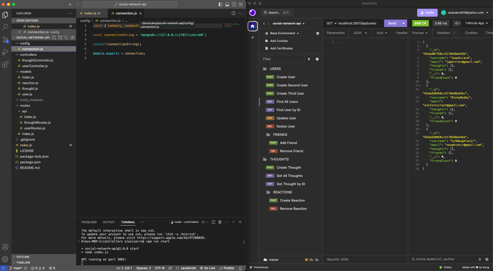

# Social Network API

## Description

This Social Network API allows for the simple production of a small scale social network. The social network is able to contain users, friendships between users, thoughts of the users, and reactions to those thoughts. 

## Table of Contents

- [User Story](#user-story)
- [Acceptance Criteria](#acceptance-criteria)
- [Installation](#installation)
- [Usage](#usage)
- [Technologies Used](#technologies-used)
- [License](#license)
- [Credits](#credits)

## User Story

AS A social media startup 
I WANT an API for my social network that uses a NoSQL database 
SO THAT my website can handle large amounts of unstructured data

## Acceptance Criteria

GIVEN a social network API 
WHEN I enter the command to invoke the application 
THEN my server is started and the Mongoose models are synced to the MongoDB database 
WHEN I open API GET routes in Insomnia for users and thoughts 
THEN the data for each of these routes is displayed in a formatted JSON 
WHEN I test API POST, PUT, and DELETE routes in Insomnia 
THEN I am able to successfully create, update, and delete users and thoughts in my database 
WHEN I test API POST and DELETE routes in Insomnia 
THEN I am able to successfully create and delete reactions to thoughts and add and remove friends to a user’s friend list 

## Installation

Clone the repo and run `npm i` in the integrated terminal. 

GitHub Repo - https://github.com/asierra619/social-network-api/

## Usage

After cloning the repo and installing the node modules with `npm i`, start the server from the integrated terminal with `npm run start`. Then open Insomnia to begin adding users, friends, thoughts, and reactions to your Social Network API.

Demo Video - https://drive.google.com/file/d/1epDsJu52U4fIwvDGNxsSolbG1K4ljZDl/view

## Technologies Used

Express, MongoDB/Mongoose, Nodemon, Insomnia

## License

MIT

## Credits

Thank You to the Following - 
Bobbi Tarkany - Calendly Tutor 
Erica and Drew - AskBCS